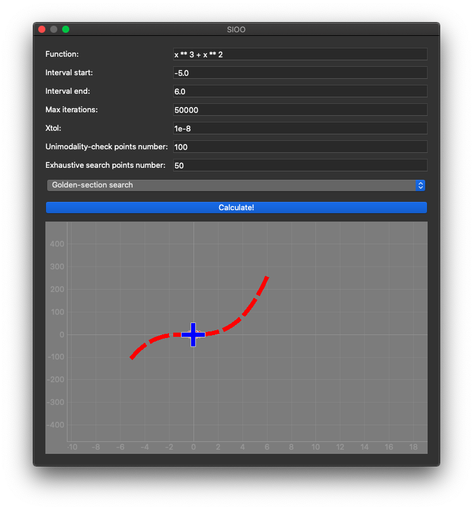

## Opis
To repozytorium przechowuje kod źródłowy zadania 1 "Optymalizacja jednowymiarowa" z przedmiotu "SIOO'.

W naszym przypadku zaimplmentowaliśmy następujące metody optymalizacji:
* Metoda bisekcji
* Metoda złotego podziału

## Instalacja oraz uruchomienie programu
Program został napiany w języku Python w wersji "3.*". Przed instalacją upewnij się, że masz zainstalowany 
odpowiedni interpeter
 Pythona. 
 
`[!] Wszystkie poniższe polecenia zakładają, że katalog roboczy to katalog repozytorium.`
 
#### Stwórz "virtual environment"
`python3 -m venv venv`

#### Uruchom "virtual evironment"
Dla MacOS i Linux:

`source ./venv/bin/activate`

W przypdaku problemu z dostępem zmień uprawnienia dostępu pliku `chmod +x ./venv/bin/activate` i powtórz krok z 
poleceniem `source`.

#### Zainstaluj biblioteki
`pip3 install -r requirements.txt`

#### Uruchom aplikację
`./main.py`

W przypdaku problemu z dostępem zmień uprawnienia dostępu pliku `chmod +x ./venv/bin/activate` i powtórz krok z 
poleceniem `source`.

Na ekranie powinieneś zobaczyc poniższe GUI:

